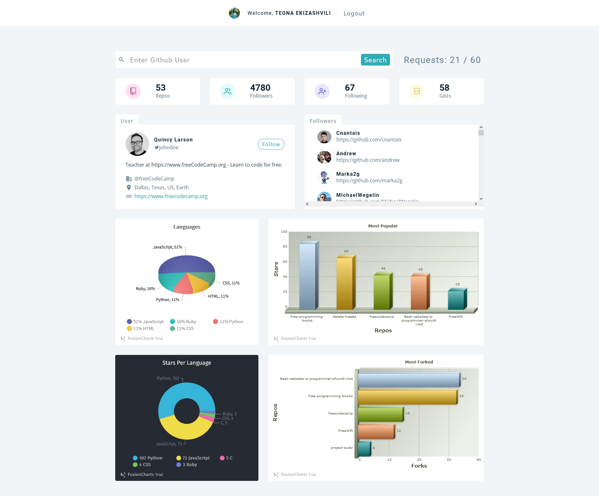

# Markdown Preview

## Built with

- @auth0/auth0-react
- axios
- fusioncharts
- react
- react-dom
- react-icons
- react-router-dom
- styled-components
- CSS
- useState and useEffect hooks
- global context

## Users should be able to:

- Log in to the website using either email and password, Google, or GitHub accounts with Auth0.
- Search for GitHub users.
- View a user's profile information, including their name, username, profile picture, and bio.
- See a user's list of public repositories, along with each repo's name, description, language, and number of stars, forks, and watchers.
- View a user's followers and following lists.
- See charts made with FusionCharts that show:
  - The most used programming languages across a user's repositories.
  - The number of stars per language across a user's repositories.
  - The most popular repositories across a user's followers.
  - The most forked repositories across a user's followers.

## Links

- Live Site URL: [GitHub User Search](https://github-users-search-ekizashvilit.netlify.app/)
